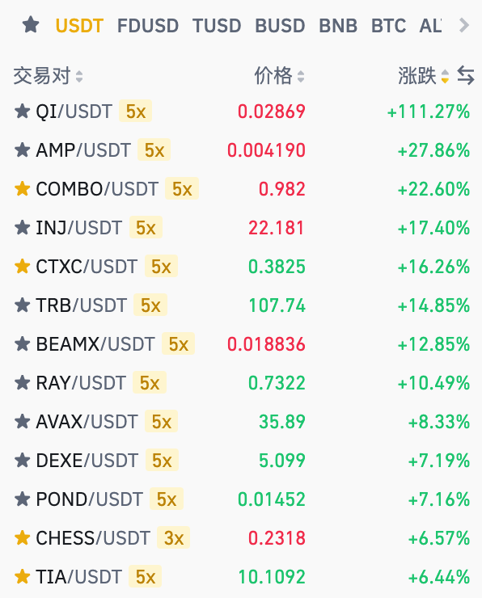

# om生态cece挖矿骗局

`先说我对该项目的定义：伪装成正常项目的，以拉人头的方式，让后来人补贴前面的人的一个项目`

## 简要介绍

### one more是什么？

该项目号称“一个就够了”生态系统，包括公链、钱包、AMM机制的swap（已下线）、DEX2.0、lp-swap、NFT交易所、区块链浏览器。它打出的口号就是区块链平台。这里暂且说它是一个看似正常平台的盘子系统。

他们项目方号称是“技术DAO”组织，该组织的人员是当年中国大陆清退交易所之后，他们离开中国大陆，然后组成的一个DAO组织，主要开发区块链平台和生态系统。当然这些都是俱乐部里面的人说的，俱乐部是什么呢，后面咱们会详细说。

### 俱乐部是什么

**该俱乐部据说是和项目方（技术DAO）认识，主要负责“one more”生态在国内的推广。**

该俱乐部是位于深圳龙华区民治街道的某栋大厦的一个办公室，办公室的老大据说是当年“盖亚”交易所的老板，2w赚2个亿的传奇人物，但是具体情况是啥咱不知道，只能听俱乐部那些人说，那些人说啥就是啥，当然我也不傻，说到优点和分歧点，俱乐部那些人就开始带有偏见的cx这个om钱包。其实只要是有独立思维的人，都知道这是在偏见的cx，但在那个环境中，很多人为了可能的收益，都难以保持本心。

俱乐部之前的名字是“one more玩家俱乐部”，现在改成“玩家俱乐部”了.png>)，我当时很纳闷，认为可能不主推“one more”项目了，当然我的怀疑目前已经应验了，因为“one more”修改"cece"挖矿兑换策略之后，把后期新进资金锁死到了合约中，只能被迫参与，长期参与。

<figure><figcaption>
俱乐部前台
</figcaption></figure>

<figure><figcaption></figcaption></figure>

